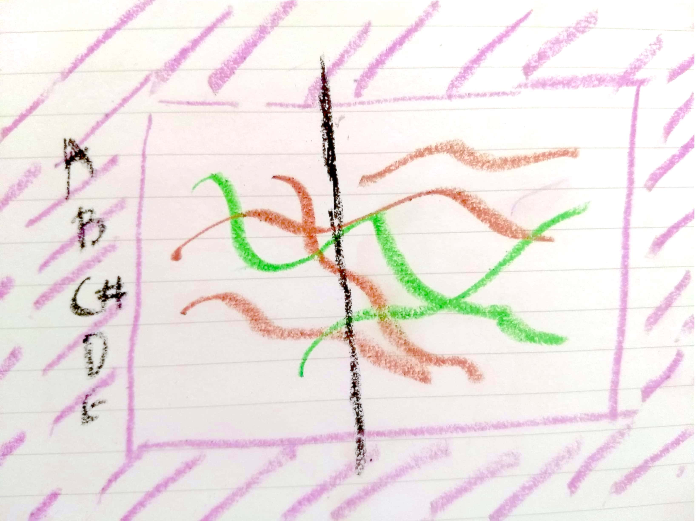
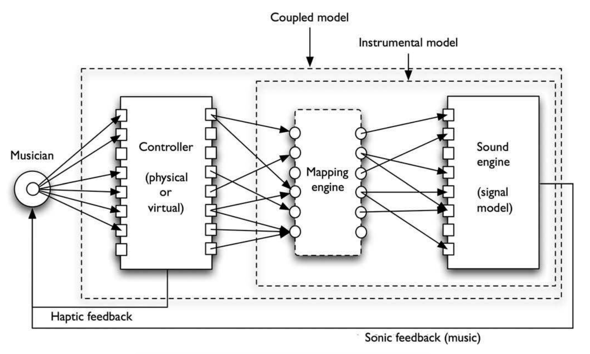

*This post covers an experiment of mine that allows a person to generate music from free-form drawing on a canvas. More than just being about a musical drawing interface, I try to take this project as an example to discuss an electronic musical instrument mapping model that I* *recently read about. It helped me understand how to think structurally about my experiment and maybe it could help others too.*


## About this experiment

For a while, I've pondered on the idea of generating music out of pictures. Imagining a picture of a seashore, and somehow being able to generate sounds that would be representative of the content in the picture. Since I didn't have any clue of how I could build it, I carried that idea for a while, until other ideas got built on top ending up simplifying the original idea to an extent.

In my head, I iterated over something in which I would detect edges in a picture, paint them on a canvas and play notes based on where a rolling playhead intersects an edge on the canvas. Edge detection seemed promising but I imagined that the results could be too random, mostly because the edge detection algorithms might not give the audience the kind of edges they are anticipating. Moreover, whatever output comes out (often undesirable), it would be out of control of the audience. So I thought why not let the audience draw these edges and make the scene look and sound however they want.

As a result of this train of thoughts, I built a very simple web-based drawing interface that can be used to generate music by drawing free-form shapes on a canvas. Some musical structure is embedded into the interface so that the user doesn't have to care so much about the musical details and can just focus on sketching.

<figure>
    
    <font size="2">
        <figcaption>Initial idea which didn't change much while hacking it together</figcaption>
    </font>
</figure>


I'd highly recommend playing around with it for a bit [here](https://ashishdubey.xyz/pastelloops) before delving into the details in the following sections.

## Digital instrument mapping

Lately, I picked up [Sonic Writing by Thor Magnusson](https://www.bloomsbury.com/uk/sonic-writing-9781501313868/) as it seemed like an interesting book for someone who holds the desire to understand what goes behind building an interactive musical experience.

While going through the instrumentality part of the book, I came across a musical instrument design model which on an abstract level describes components of a digital musical instrument. This seemed like a good way of thinking about my free-form drawing interface as a digital music instrument.

<figure>
    
    <font size="2">
    <figcaption>Mapping model diagram taken from: <a href="http://sro.sussex.ac.uk/id/eprint/46868/1/34.4.magnusson.pdf">http://sro.sussex.ac.uk/id/eprint/46868/1/34.4.magnusson.pdf</a>
    </figcaption>
  </font>
</figure>


## Deriving the mappings in Pastelloops

In this section, we're going to take each component described in the instrument model and try to explain how Pastelloops satisfies that constraint.

### Sound engine

As of today, Pastelloops has two brushes of different colors - brown and green. Each brush is associated with a specific sound that it generates. One of them is a synthesizer with a custom set of overtones and slow attack and decay rate leading to smooth tone color. Another one is a synth loaded with grand piano samples.

The sound engine in this application is powered by WebAudio API which makes it possible to function in a web browser. An amazing JS library called [Tone.js](https://github.com/Tonejs/Tone.js/) is used for implementing all the audio functionality. Tone.js, as I've emphasized in my previous blog posts and as emphasized by others, makes it easier to build audio applications in the browser, than by using WebAudio directly.

Another library called [Tonejs-instruments](https://github.com/nbrosowsky/tonejs-instruments) is used to load grand piano samples and create an instrument node.

For reference, I'm adding a snippet that shows the construction of two audio sources -

```javascript
var synth1 = new Tone.PolySynth(5, Tone.Synth, {
  oscillator: {
    type: 'custom',
    partials: [0.2, 0.2, 0.01]
  },
  'envelope': {
    'attack': 0.5,
    'decay': 0.5,
    'sustain': 0.5,
    'release': 0.5
  }
})

var synth2 = SampleLibrary.load({
  instruments: 'piano',
  baseUrl: 'https://nbrosowsky.github.io/tonejs-instruments/samples/'
})
```

### Mapping engine

The sound is generated based on where the playhead intersects with the points drawn on the canvas. The color of the intersecting point decides which synth to be used for generating the sound. The pitch that is played is decided based on where on the `y` axis is that point. One thing about Pastelloops that assists the user in generating a musical output regardless of what they draw, is that all the notes that are played form a single scale. Depending on which scale is selected by the user, the range of notes *start from the root note of the scale in octave 1* and end at the *last note of the scale in 5th octave*.

The following is a snippet that is used to change the scale -

```javascript
const modeIntervals = {
  major: [0, 2, 4, 5, 7, 9, 11],
  dorian: [0, 2, 3, 5, 7, 9, 10],
  myxolydian: [0, 2, 4, 5, 7, 9, 10],
  phrygian: [0, 1, 3, 5, 7, 8, 10]
}

function switchScale (tone, type) {
  var scaleNotes = []
  var intervals = modeIntervals[type]

  for (var i = 1; i <= 5; i++) {
    scaleNotes = scaleNotes.concat(Tone.Frequency(tone + i).harmonize(intervals).map(function (f) { return f.toNote() }))
  }
}
```

### The interface

The interface looks like a very simple drawing application. Because the interface is a web application, it can open on any device with a modern browser (tested on Chrome, Firefox, and Edge) without an installation requirement.

When the interface has loaded, the user can use their trackpad or mouse on a computer or their finger on a touch-enabled device to draw over the canvas. The default selected brush is used unless the user decides to change it using the buttons corresponding to each brush. The eraser button can be used to enable the erase tool which can be used to clear off specific parts of the canvas. P5.js which is a Javascript port of processing language has been used to build the sketching interface and perform all the transitions.

The default selected scale is A Major which can be changed using two dropdowns - one for selecting note of the tonic center and the other for the type of scale. The foundation scale for the mapping engine changes as soon as any change happens to this selection, and the resulting music output changes based on that.

### Sonic feedback

An important part of any musical instrument is the feedback that you receive when you interact with it, like hearing the sound of a guitar when you pluck a string. That is true for a digital instrument as well, and I tried to incorporate it somehow in Pastelloops.

A rolling playhead scans the canvas from left to right, looking for any pixels drawn along the vertical axis at a given `x` position. 

While this is like a playback mechanism, it would seem lacking if there was no immediate sonic response to the drawing interaction with the canvas. To counter the lack, the playhead is moved to the place where the user decides to draw. This ends up triggering all the notes that fall along the playhead.

## Inspiration from other related ideas

While much of the work done so far has been limited to personal exploration of the idea, some research along the similar lines has led to a lot of ideas which can be potentially used to improve the project further.

### In visual arts

> "One day I must be able to improvise freely on the keyboard of colors: the row of watercolors in my paintbox" - Paul Klee

The ideas like associating shade of color with musical keys among so many others have existed for a long time in arts. Artists like [Paul Klee](http://www.paul-klee.org/music/) and [Kadinsky](https://www.theguardian.com/artanddesign/2006/jun/24/art.art) have reflected a strong inspiration from music into their art work as paintings. 

Paul Klee had a deep interest in deriving relationships between musical rhythms and structural composition in his paintings. He studied pieces from Bach and Mozart, and tried to draw differences between individual and structural elements of music and tried to apply them in his paintings. Structural elements consist of the repeated patterns like measures or a chord progression whereas individual elements would be something like a melody line. Such ideas can be helpful in mapping the rhythmic components with a more aesthetic visual quality into the drawing surface of Pastelloops, making it appeal better to visually inclined users.

### In experimental music

An area of potential application of this project is in live musical performance. In recent times, we have seen many alternate mediums of musical performance such as live coding environments like TidalCycles, Gibber, FoxDot etc. These help artists setup their musical tools as code and intertwine them as they perform.

I see Pastelloops functioning similarly except instead of musical tools or structures written in code, an artist can draw them on the canvas and traverse them in order to perform.

Such a performance can be seen here - https://www.youtube.com/watch?v=WrLb8WA3yHs where the artists draw on a canvas using a brush and with multiple axes crossing the drawn area, sound is generated.


### In contemporary interactive music research

Perhaps the closest related work to Pastelloops in terms of design motivation and implementation are other drawing based tools built for composing music.

#### Griddy
[Griddy](http://hdl.handle.net/2027/spo.bbp2372.2014.053) is a music composition system that uses drawing
as its main interface, along with chord map and background image. It uses a background image for style-related features and applying an image sonification based method to probe the image to allow users to use the result as a base for their musical exploration.

#### Hyperscore
[Hyperscore](https://opera-beta.media.mit.edu/portfolio/hyperscore) is a graphical composition environment that interprets the gestures of the strokes and lines the user draws in an intuitive way. The user can pen musical ideas, store them for later use, and create new pieces—all in one expansive canvas. The graphical elements in the drawing are mapped to musical structures, allowing the user to interweave and shape musical voices and define harmonic progressions visually.

There are many parallels that can be drawn between the two and Pastelloops. Some notable divergence is in the live performance contexts. First is in the inspiration to make its usage analogous to a live coding environment. An artist can draw structures on the canvas mapping to desired musical structures. Throughout the performance, the artist can scan the canvas or parts of the canvas using one or more playheads and loop through the musical structures that they drew on the canvas.

Another is in the extension of the interface from a simple cursor based usage to a touch-based usage. Using touch gestures, the user may not just control the pitch structure, but also other attributes of the drawing which can be mapped to the timbre of the sound produced.

Finally, the design of the application allows for breaking it up into modules which can be indepedently changed and mashed up together in several different ways leading to new interactive musical experiences.

## More possibilities on the web?

As you can see that this mapping model can help in breaking an interactive musical application into abstract components. Most often these abstract components can be changed independently to create a new overall experience. With so many capabilities on the web platform, different kinds of tweaks can be thought of and permuted in order to create new experiences . I'm using the following section for just that.

### Augmenting digital UI with a physical interface

Through different web APIs in the browser, it's already possible to interface with different devices that could act as complementary affordances to the digital music interface.

There is WebMIDI API using which one can build an experience around a MIDI controller. There is WebUSB using which one can build an experience involving a wider variety of physical inputs - like different kind of sensors. Similarly, WebVR can open up all-new possibilities creating virtual worlds as interfaces to play music.

### Collaborative musical experiences

Because these interfaces are designed on the web, not only they are easy to access for a user, but it's also easy to build an application that can involve different users in the musical experience. Web APIs like WebRTC offer to build a p2p networked application, which can be used to transmit interactions. Very specifically in Pastelloops, such a capability can be used to build a collaborative sketching interface towards an experience of music jamming using sketches for friends located in different geographies.

### Applying machine learning

Real instruments are interesting because there is unpredictability or noise that comes with them. The strings of a guitar get old and lead to a change in tone color. One of the reasons why guitars sound different to a varying extent which makes them kind of cool. With a digital instrument, however, no variance is introduced no matter how many times you play it. A sound signal is 100% reproducible, every time a particular interaction is repeated. That doesn't sound as much as fun as a physical instrument. How do we incorporate noisy characteristics of a physical instrument into a repeatable musical machine and yet ensure the output is musical?

With the latest research in musical applications of AI, we've come up with ways and means to do such things. [Google's Magenta project](https://magenta.tensorflow.org/) has some great examples of this. What's great? There's a JS library that brings Magenta project in the browser which lets you build applications that help you use AI to synthesize sounds, continue of a sequence of notes or interpolate a melody between a set of melodies that you feed into the system.

## References

- Verdi, Richard. “Musical Influences on the Art of Paul Klee.” Art Institute of Chicago Museum Studies, vol. 3, 1968, pp. 81–107. JSTOR, www.jstor.org/stable/4104301.
- Griddy: a Drawing Based Music Composition System
with Multi-layered Structure 
- Hyperscore https://opera-beta.media.mit.edu/portfolio/hyperscore