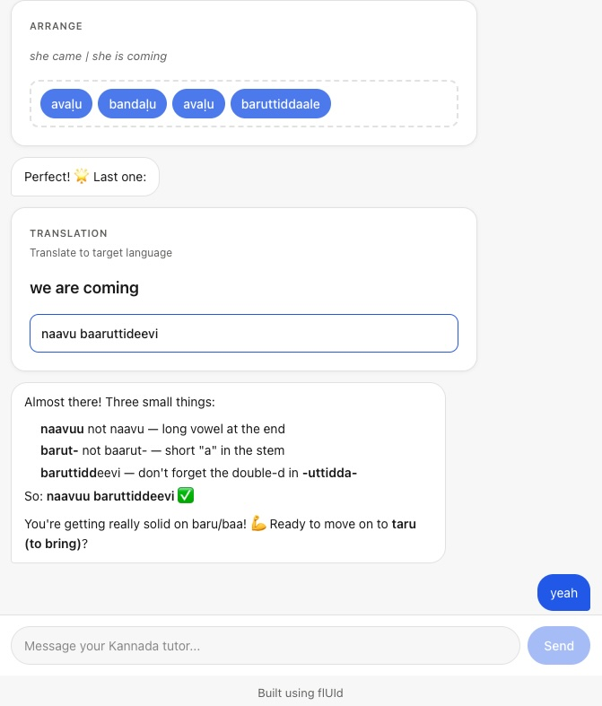

I've been toying with AI to learn Kannada language for a while. I still can't speak or understand fluently, but that speaks more about my capability to learn a language with discipline. With different LLMs however, I've been able to learn specific words, phrases and sentences in context, with proper breakdowns. It's been a great explainer of things that I want to know. If I have the right question about the language, a model does a decent job at answering them. I can't speak for every LLM because my experiments have been mostly done on GPT (via ChatGPT or Open AI API) or Claude Sonnet 4.5+.

The point of me writing this down is to talk through the evolution of my personal language assistant as I have liked to view it and my parallel experiments with generative, adaptive UIs. While I have been consistently using ChatGPT like a mortal for regularly finding contextual translations, I've also been building experimental apps on top of LLMs, partly to build a very personal learning assistant but also to validate my ideas to build adaptive app UI/UX using AI. 

### Adaptive UI/UX?
I've spent a big chunk of my career, like many engineers, working on backend, frontend and supporting infrastructure for an engineered UI (web or a mobile app) for pre-defined user flows. If I were to build a working logging app - I'd have to think of what a user might want to enter as an input, when, and how they'd do it. This would all be thought out with a combined team effort of minds in the concerned workout, product, backend and frontend engineering. An orchestration of workout plans and goals, buttons, input boxes, sliders, database tables, APIs, and what not. And this would typically be done for a specific workout or a type of workout, which makes building apps like this harder and hence fewer. For instance, as a climber, I couldn't find an app to track a sort of bespoke training plan. Now I could either employ a team of experts (or become one) and spend a couple of weeks or months to build an app, but that was pre-LLM era. Now, I could simply use the condensed knowledge about various workouts and code generation capabilities of an LLM to build such an app in maybe a day. That's a norm now. Most people can do this especially given the rise of many vibe-coding platforms which do it all from taking briefs to deploying a fully-ready application. So 100s of people can build 100s of such workout apps. It's got its pros and cons which I'll leave up to the reader.

Adaptive UI/UX takes a different approach. An adaptive workout logging app isn't built in terms of fixed screens, buttons, inputs, etc. An adaptive app automatically takes the shape of the most likely solution to the user's problem.

Let's walk through the evolution of my experiments.

### Prompt Chaining
My earliest experiments started with basic prompt chaining. I used the OpenAI APIs directly and chained up a series of prompts. At each step in the chain, the system prompt would ask the LLM to wear the hat of an expert, take the incoming brief as a prompt and generate an output for the next step. For instance, if a user wanted to log their deadlifts, the LLM would be asked to first act as "a deadlift expert" (wonder if they exist) which would produce a brief containing the best practices and progress plan for the user given their goals. This brief would be fed to the next step, where the LLM acts as a product manager who specs out user stories based on what the expert thinks the user should be logging. These user stories would then be fed to the LLM which acts as a designer which specs out an optimal layout in terms of information hierarchy and what interactions are exposed to the user - buttons, input texts, toggles, dropdowns, etc. Finally the LLM acting as a software engineer in the next step, would take the user stories and design spec, would construct a UI template using the components it has available which best match to the requested UI and that finally gives the user their own page for logging their deadlifts.

This seemed magical at first. I tested it with various activities and it seemed promising. One app to log any kind of activity? That sounded really cool and what I was gunning towards. But as I tested it in the real world more (with my own workouts), the wowness subsided, and I started seeing real issues. The biggest issues were the "one-shot" nature of this experience generation. The user inputs a brief on what they want to track - and then assembly line based on the prompts takes over and creates something for you. If you don't like - you start over. I added a way for the user to edit requirements and tweak the experience. It got a little better but not enough.

### Prompt Chaining with Human in Loop
With the full-chain customization as described above, it was getting hard for a user (mostly me) to arrive at exactly the kind of experience needed to track the required activity. I realized that the chain was pretty effective at the spec-ing out the actual UI and generating it given the requirements were correct. It was the expert brief that needed to be more accurate with the user's requirement. I did an experiment to break the chain and put a human into a conversation with the model at the first step. The user would input their requirements which could be - "I want to learn Kannada" or "I want to climb a V3 at indoor gym", and then it would go into a conversation with the LLM which acts as a coach in that field and ask the user some questions to clarify until they agree over a brief. This brief contains a curriculum, theory, drills, and progress tracking guidelines. It is fed to the design and engineer steps which spit out an app which contains a goal driven experience that teaches the user and also helps them practice. This looked much better and it fit many different use-cases well.

This was a general purpose learning app which was an upgrade of the general purpose activity tracking app. It had a better structure and it converged better to the user's requirements. But it had problems too - and it was again to do with how rigid it felt. When learning a language, the vocabulary was planned upfront. This was hard to review because it was generated by the model based on the brief. If I were to learn to play guitar, it would sometimes have riffs which were not related to the goal, which was fine if it could be edited but that wasn't possible. For something that could potentially be very natural, like a student talking to a coach on a daily basis - this was a little too mechanical.

### Agentic Loop with PI Harness
The potential of a very natural workflow mimicking that of a daily interaction between a coach and their student was the backdrop of my next iteration. The challenges that I saw in the prompt-chaining method even with the human in loop, were less problematic when I tried learning iteratively with a chat agent like ChatGPT. This was also true with coding agents which are very easy to iteratively converge to your vision turn by turn. I wondered if I could combine the generative UI elements of my earlier iterations with the interactive steering capabilities of an agentic loop.

I was a bit inspired by the usage of PI Coding Agent as the core of OpenClaw which demonstrated the application of an open-source coding agent into a more general purpose agentic loop. Now I could build my own agentic loop from scratch using other AI SDKs which I honestly did try. But very early on, I ran into bugs which I felt were well handled in a mature agent harness like PI. It did not make sense for me to DIY things like memory and context management, tool-call loops, retries, etc, when they were available in well maintained and growing open-source tooling.

So I tried exploring this idea and quickly got to a point where something materialized. With PI agent running server-side and a react hook on the frontend streaming the conversation bi-directionally - I had the foundation ready. The component library was mapped as tools which made it possible to render UI components for different exercises. A cool thing about this was that it was possible to also get inputs from the UI components and feed it back to the PI agent loop. All of this tied together resulted in a highly interactive conversational UI. A user could interact with the widgets as well as use chat to steer the model. This looked like best of both worlds. With a lot of these basics baked in well into it, the app has been quite useful to me. It's been acting like a very useful learning copilot for me. Thanks to the foundation, it's easy to build features like pronunciation tests or a long-term learning plan based on user's goals. I abstracted out the foundation as a re-usable library that could be used to build more such copilots easily. I called it flUId (https://github.com/dash1291/fluid) for what it does - helps you build fluid adaptive UIs.

### Next Steps
I started with the idea of general purpose generative copilots and somewhere along the line I had to narrow down and figure out for myself, both as a user and the developer, to make it shine for a specific problem statement. That helped and brought me to flUId. With flUId, a developer like myself can build a copilot for a specific problem statement wherever a generative UI is required but the framework is abstract enough that it can be bootstrapped with the right kind of components and system prompts that can help a user learn and practice any skill - learning any language or finger-style guitar. To test how well it works, is going to be my next step in this series of experiments. I'm very hopeful that something interesting will come out of it. Whether or not it is effective in teaching me these skills, would be another story.