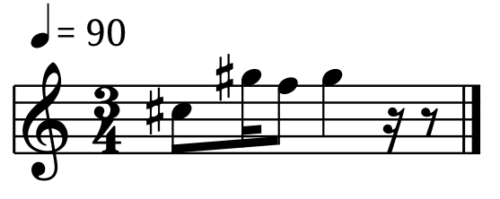
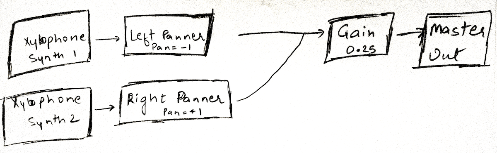
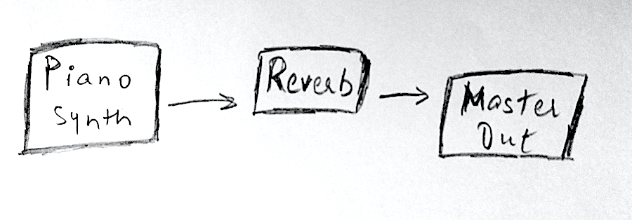

In the last few months, I’ve spent quite a bit of spare time and effort in learning about music theory and sound engineering. This includes learning enough about harmonics to be able to play simple musical motifs on an electric guitar, understanding basics of sound synthesis and processing. On top of this, I also got exposed to electronic art that is created on the basis of systems and processes rather than being written as a finite progression of harmonics. Incase you’re wondering what I’m talking about look up Brian Eno, Steve Reich, Terry Riley and related artists.

So, I’ve been interested in generative art of all kinds for a long time. And I gained some momentum after being exposed to all the information mentioned previously and really good hands-on material like [this extensive article](https://teropa.info/blog/2016/07/28/javascript-systems-music.html) which set things straight on how these systems can be built programmatically. One of my recent hacks on these lines lives at [noisescape.glitch.me](https://noisescape.glitch.me). This is a simple systems music experiment written in JavaScript using WebAudio API. It’s a combination of [phase music](https://en.wikipedia.org/wiki/Phase_music) generated using xylophone notes playing in two loops and some piano notes looping at different intervals.

I’m going to break down the experiment into the different components and write about them in the following paragraphs. This is an amateur classification so please let me know if I miss a detail or overstate a few.

## Harmonics

In this part we'll talk about the musical structure of the experiment. There may be a bunch of music theory concepts which may not fit in the scope of this article, hence linked to external resources so that you can read about them.

It was important to make the generated music sound nice but there is also only so much that can be done and should be done here. It’s more about the patterns which the system creates with the combination of simple loops. So in order to make the generated output not sound bad, all of the notes played in this system are taken from the C# Major arpeggio. If you play music, you might already know that an [arpeggio](https://en.wikipedia.org/wiki/Arpeggio) refers to the notes in a chord played in any order. This set of notes is used in two ways -

First, for creating a simple melody based on 3 notes and running it in a loop that repeats after every [3/4th measure](https://en.wikipedia.org/wiki/Bar_(music)). These loops start together in phase and as the music progresses they phase changes and new patterns emerge. For those who can read music, I included a pitch sheet below for indulgence -

Secondly, we use this arpeggio to create a foreground piano line with 7 notes looping at different intervals. Since they loop at different intervals, the notes would play in various combinations for a long time.

Here are all the notes that are used -

***G# and C# in octave 3***

***G#, C#, F, F# and A# in octave 4***

Since these notes form a major chord, they are very consonant with each other. Consonance and dissonance are music theory concepts which you can learn better from [other resources](https://en.wikipedia.org/wiki/Consonance_and_dissonance). In the context of this experiment, this piece of information helps because we can be sure that when we play any of these notes in any order or even together (in either the 3 beat long xylophone line or the piano loops), they’re going to sound good. And the sound's tonic centre would be is C# major. However, just to make the piano line a little more interesting, I picked another note from outside of the arpeggio but still not dissonant with other notes.

Playing all of these notes, and other musical aspects like timings and measures in this experiment are achieved with [Tone.js](https://tonejs.github.io) library which is a great abstraction over WebAudio API in the browser.

## Sound design

We've talked about what sounds we play in this experiment, but how we play them is as important. This is actually where much of the magic happens. The texture of sound and the machinery that keeps the music ever changing is discussed here.

I wanted to generate sounds of real instruments so that the output can be related to by variety of listeners. [This library](https://nbrosowsky.github.io/tonejs-instruments/) made it really easy for me to be able to generate sounds like of real instruments. I didn't have to deal with hooking up each instrument's recorded samples into Tone.js myself. I used the already available xylophone and piano samples which are hosted by the author themselves.

Using Tonejs instruments' API I wrote down two synth nodes playing Xylophone notes (which are chosen as mentioned above in Harmonics). These synths nodes are connected with a [Gain node](https://tonejs.github.io/docs/r12/Gain) with gain level = 0.25 which means the xylophone loops are played at 25% volume. Each of the loops are connected to [Panner nodes](https://tonejs.github.io/docs/r12/Panner) which routes the sound of each loop through left and right channels giving it a stereo stage. As the phase increases this leads to interesting sound effects which may seem like echo or ping-pong at different times.

While piano notes sounded great, I felt like they could be smoothened up a little to meld as slowly playing background music while the xylophone phase varies. For that I added a [Reverb node](https://tonejs.github.io/docs/r12/Freeverb) to the piano synth. This seemed to do the trick as the signal decays slowly. [Reverberation](https://en.wikipedia.org/wiki/Reverberation) generally adds a feeling of spaciousness to a sound that is run through it.

As these notes repeat, they tend to play in various combinations and patterns, which are hard to predict in the beginning. This makes the generated music feel like it's repetitive but something is always changing.

## Noise interaction

Another variation that happens to this looping music is controlled by the environment making this system even more unpredictable. This variation is based on the noise levels in the environment. To achieve this an [Analyser node](https://developer.mozilla.org/en-US/docs/Web/API/AnalyserNode) is used to obtain [frequency domain data](http://www.elvers.us/perception/soundWave/) of the default input and the values are averaged over the entire range to give an overall noise level. Although not accurately the noise level as it's prone to discounting few frequencies playing at high levels. Let's see if I can do better in future.

Anyway, ***The noise level controls the speed at which one of the loops plays.*** This means as the noise in background increases, the loops phase out further and with a decrease, the loops come back in phase.

The coolest part about this hack is that it has given me a mental framework to think over when trying to build procedural art in future. I can not only fantasize about creating something but I know how to proceed, which actually results in more ideas. It’s a circle. Not sure what exactly follows from here, but definitely a string of more experiments. If you're a musician (especially electronic) or a technologist interested in music, I'd love to hear your thoughts on this.
