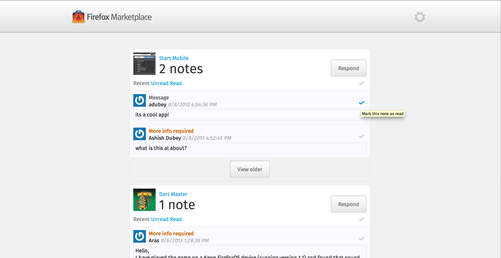

*This is one of the awfully long-time overdue posts I've had in my mind, but have not been able to make it on this space. But since its never too late, I'm writing about the cool project I was working on while interning at Mozilla during the summer of 2013.*

## About Marketplace

[Firefox Marketplace](https://marketplace.firefox.com), for the uninitiated is the platform where developers can host their Firefox apps which run on desktop and mobile (of course including Firefox OS). It acts as the central repository of apps, from where users can download and install apps on their systems. And by that I don't mean a plain repository of apps which just allows you to download apps, but also essentials like compatibility checks, app analytics, ratings, reviews, etc. Just like [Firefox Add-ons](https://addons.mozilla.org), there are apps for various kinds of users on Marketplace. Since Mozilla cares much about the quality of the apps served to its users, it makes sure that the apps meet a quality standard before they are available on the Marketplace. For this purpose, there is process of App Review which comes after a new app is submitted to Firefox Marketplace and before it is available to the users for download. App reviewers, which include paid staff and volunteers, take a close look at the submitted apps, beyond just the description of it. It includes inspecting the app's functionality, performance, and security. If the reviewers like it, it goes live for the users to download, if not, the developer (who submits the app) is notified about the issues found during the review, and the developer is expected to fix those before it can be reviewed again and made public.

## About the Problem

So, in the Marketplace workflow, we have three kinds of users namely, developers, reviewers and users (Firefox users who download the apps). The review process is basically hidden from the users as it is not relevant to them. Its the developers and reviewers which interact with each other during the review process mainly for feedback, reporting issues and asking questions. The Reviewer Tools provides a dashboard for the reviewers to review apps, which allows them to pick apps they want to review, and take actions on the apps they are reviewing (that is reject, make public, delete or ask for more information). On the other hand, Developer Hub is the dashboard for the developers, which they can manage apps (that is upload an app, edit uploaded apps). Though, this is an efficient workflow for both developers and reviewers, but on the communication front they are a bit disconnected. Every time, a reviewer takes an action on an app, its developer is notified about the action and the enclosed comments in an email. If the developer has any question or comment on the action, they reply back to the email which is delivered to a mailing list which has all the reviewers as its members. While the process works and is transparent, its not the best experience for both developers and especially reviewers. There is no central place in Marketplace where users can view all their conversation. It is totally tied up with their email. Also, communication on mailing lists gets messy after a while, reviewers have to keep track of developers' email addresses, among other hassles. So my project for the summer was to revamp this process in the following ways:

1. Create a dashboard for both reviewers and developers to access their present and past conversations. This should be used to read and reply to the messages exchanged between the users.

2. Bridge the email conversation and dashboard, so that the users can use both modes of communication as they please.

## About the Solution

This is what a part of solution looked like:

This is the communication dashboard frontend which is written over the same codebase that the Firefox Marketplace is based on, that is [fireplace](https://github.com/mozilla/fireplace), which is essentially a homegrown client-side framework with Marketplace specific bits like how the requests are dispatched, responses are cached, and rendered. Later, most of the Marketplacey commonware was abstracted out and [commonplace](https://github.com/mozilla/commonplace) was born, which served as the base for all other Marketplace related projects, including communication dashboard frontend, source code of which resides in [commbadge](https://github.com/mozilla/commbadge).

## More About the Solution

A little about the frontend was described above, but that was only a part of the entire thing. The frontend is basically a client-side app which talks to the Marketplace REST API, for reading/writing communication dashboard data. This is actually how Firefox Marketplace works. The frontend is a client-side app which fetches data from the Marketplace API and renders it using [Nunjucks](http://jlongster.github.io/nunjucks) templating library. The Marketplace API codebase is written in Python/Django (codename [zamboni](https://github.com/mozilla/zamboni)), and is huge and might require an additional blog post to get into the details. For the purpose of this post, lets just stick to the details of Marketplace API relevant to the communication dashboard API.

The REST API is written using the [Django REST Framework](http://django-rest-framework.org), which makes it really easy and quick for writing new API endpoints, once you understand how it works. Since, I had worked on Tastypie before, it took me a while to understand different parts of DRF work together, but spending time reading the documentation and codebase itself, yielded good results. I realized that DRF is infact, very simple and flexible framework, making it really easy to control different parts of an API request lifecycle in DRF, simply by extending different classes that DRF provides. I've actually used DRF for another personal project of mine, and it helped setup an API in no time.

One requirement of the project, is to be able to handle the incoming email replies. This means that, a reply to a message sent from communication dashboard can be sent over email and the replies should be tied to the same conversation thread. This is done by sending an email for every message that is sent from the communication dashboard, to the recipients of the message through email. A unique reply token is embedded in the *Reply-To* address of each email, which internally corresponds to a single conversation thread. Whenever a reply is sent to the reply address, the email server pipes the email to the communication dashboard API, which in background then extracts this reply token and figures out which thread it belongs to and creates its record in the database. Works pretty neatly.

## About the Result

Much of the prototyping was done by the time I was done with my internship, but the project could not get deployed, which kept me from addressing the real issues it might face in production. But it was a fun ride. It was challenging to find edge cases, and dozen of issues which would arise in every single bug that was part of the project.

My project presentation can be viewed at [air.mozilla.org/2013-intern-dubey](https://air.mozilla.org/2013-intern-dubey), slides of which are available [here](http://slid.es/ashishdubey/internpresentation13).

In a nutshell, I had an awesome summer!

## Thanks

The awesome summer would not be possible and much fun without my supervisor [cvan](https://twitter.com/cvanw). Learnt so much from him and [Matt Basta](https://twitter.com/mattbasta) while working on commbadge, commonplace and zamboni, having fun code reviews. [Wil Clouser](https://twitter.com/clouserw) and the entire Marketplace team for a place in the awesome team.

Special thanks to [Kevin Ngo](http://ngokevin.com) for taking forward the work on communication dashboard, making it awesome and suck less.
